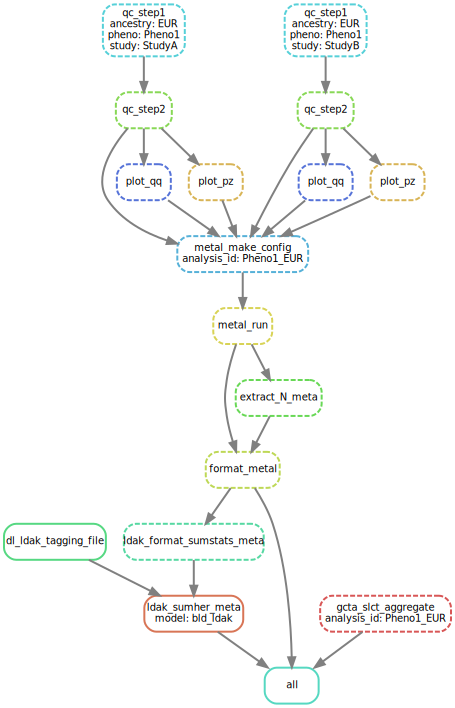

# HERMES 2 GWAS

This repository contains code and computational pipeline
to reproduce key analyses performed in the genome-wide association study (GWAS)
of heart failure subtypes and dilated cardiomyopathy manuscripts (2024)
from the HERMES Consortium.

The analyses are wrapped in a [*snakemake*](https://snakemake.github.io/) workflow management system
as illustrated below:



The figure above is a toy example which performed the following:
* Two-step quality control (QC) of GWAS summary statistics of a phenotype labelled as `Pheno1_EUR` 
from study A and B following the procedure
described in [Winkler T, *et al.* 2014](https://www.nature.com/articles/nprot.2014.071) 
* Fixed-effect meta-analysis of GWAS of `Pheno1_EUR` using [METAL](https://www.ncbi.nlm.nih.gov/pmc/articles/PMC2922887/) 
* Conditional-joint association analysis using GWAS summary statistics from the meta-analysis with (GCTA-CoJo)[https://yanglab.westlake.edu.cn/software/gcta/#COJO]
* SNP Heritability assessment with [LDAK](https://dougspeed.com/snp-heritability/)  

Details of each step of the analysis, as represented by a *rule* (polygon in the figure),
are described on the [Rules](#rules) section

## Rules

| Rule                        | Description                                                                                                                                                                                      |
| :-------------------------- | :----------------------------------------------------------------------------------------------------------------------------------------------------------------------------------------------- |
| `qc_step1`                  | **Step 1 QC**: sanity check, create unique variant ID, harmonise allele (see **Note** )                                                                                                          |
| `qc_step2`                  | **Step 2 QC**: QC based on allele comparison with reference panel (see **Note** ). For I/O efficiency, this step also makes an *AFCHECK* plot (allele frequency comparison with reference panel) |
| `plot_qq`                   | Make *QQPLOT* (observed vs. expected log P-value)                                                                                                                                                |
| `plot_pz`                   | Make *PZPLOT* (reported vs. calculated P-value)                                                                                                                                                  |
| `metal_make_config`         | Create config file for meta-analysis with METAL                                                                                                                                                  |
| `metal_run`                 | Run meta-analysis with METAL                                                                                                                                                                     |
| `extract_N_meta`            | Extract N sample and other metadata from METAL log file                                                                                                                                          |
| `format_metal`              | Reformat METAL output                                                                                                                                                                            |
| `dl_ldak_tagging_file`      | Download pre-computed [LDAK tagging file](https://dougspeed.com/pre-computed-tagging-files/)                                                                                                     |
| `ldak_format_sumstats_meta` | Reformat GWAS summary statistics for LDAK input                                                                                                                                                  |
| `ldak_sumher_meta`          | Perform LDAK SumHer SNP heritability estimation                                                                                                                                                  |
| `gcta_slct_aggregate`       | Perform chromosome-wide conditional analysis with GCTA-CoJo                                                                                                                                      |
| `all`                       | Dummy rule to get target outputs (adjust in `workflow/Snakefile`)                                                                                                                                |

**Note**

**Step 1 QC**

-   For sanity check, the `qc_step1` rule **excludes** variants with **any** of the following criteria:
    -   beta \> 10
    -   standard error \> 10
    -   *P* value outside 0-1 range
    -   imputation (INFO) score outside 0-1 range
    -   Allele frequencies outside 0-1 range
    -   N effective \< 50
    -   imputation (INFO) score \< 0.6
    -   If INFO score is missing & N effective cannot be calculated:
        -   Minor allele frequency (MAF) \< 0.01
-   N effective (effective sample size) is calculated as $N_{eff} = 2 \times MAF \times (1-MAF) \times N_{total} \times INFO$
-   Each variant will be assigned a unique ID in the format **chr:pos:A1_A2**, where **chr:pos** refers to chromosome and base pair position according to the [NCBI GRCh37](https://www.ncbi.nlm.nih.gov/assembly/GCF_000001405.13/) genome assembly, and **A1**\_**A2** refers to allele 1 (effect allele) and allele 2 (other allele) in alphabetical order.
-   Accordingly, the regression coefficient (i.e. beta / log odds) of each variant is harmonised to reflect the effect allele (A1)

**Step 2 QC**

-   Based on allele comparison with reference panel, the `qc_step2` rule further **excludes** variants with **any** of the following criteria:
    -   unique variant ID not found in the reference panel (as the unique variant ID is constructed using genomic position and allele information, this will exclude any mismatch on those)
    -   MAF difference with reference panel \> 0.2


## Input data

This repository includes dummy study-level GWAS summary statistics and a small subset of reference genotype from 1000G project
that are stored in the `data` directory. 
**These data are for illustration only and are not suitable for running actual analysis**

To reuse the pipeline with other data, please follow the structure within the `data` directory

## Executing the workflow

To execute the workflow, first clone the repo to local machine & enter the directory e.g.

```
git clone https://github.com/ihi-comp-med/hermes2-gwas.git
cd hermes2-gwas
```

The worfklow can then be executed by using snakemake CLI (tested on version 8+) e.g. 

```
snakemake -c all
```

This will generate files stored on the `results` directory using the provided test dataset.
The target output files are defined in the `workflow/Snakefile` under the rule `all`

Output from specific analysis can be requested by specifying the target file.

For example, the following command will run summary-level QC and generate some diagnostic plots for `Pheno1_EUR` phenotype from `StudyA`

```
snakemake -c all results/qc/step2/StudyA/GWAS-QC2_Pheno1_EUR.tsv.gz
```

Please consult the [`snakemake` documentation](https://snakemake.readthedocs.io/en/stable/index.html) for guidance and additional examples.

##  Package dependencies
If the required software stacks are not available on the local system,
the workflow will try to solve package dependencies & required softwares by
using [conda](https://conda.io/projects/conda/en/latest/user-guide/getting-started.html)
and / or [Apptainer](https://apptainer.org/docs/user/latest/index.html)(formerly Singularity).

This can be executed by running:

```
snakemake -c all --sdm apptainer conda
```

Until this note is removed, this feature is considered experimental.

## Ancillary analyses

Other ancillary analyses reported in the published manuscripts that are not yet
implemented in the workflow can be performed using
publicly available softwares, listed below:

| Analysis                                             | Software / Dataset                                                                                    | Version  / Release date |
| :--------------------------------------------------- | :---------------------------------------------------------------------------------------------------- | :---------------------- |
| Functionally-informed fine-mapping                   | [`polyfun`](https://github.com/omerwe/polyfun)                                                        | v2023-11-14             |
| Multi-trait analysis of GWAS                         | [`MTAG`](https://github.com/JonJala/mtag)                                                             | v1.0.8                  |
| Genetic correlation                                  | [`LDSC`](https://github.com/bulik/ldsc)                                                               | v1.0.1                  |
| Mendelian randomization                              | [`MendelianRandomization`](https://cran.r-project.org/web/packages/MendelianRandomization/index.html) | v0.7.0                  |
| Genetic colocalization                               | [`coloc`](https://github.com/chr1swallace/coloc)                                                      | v5.2.3                  |
| Variant annotation                                   | [`annovar`](https://annovar.openbioinformatics.org/en/latest/)                                        | v2020-06-07             |
| Variant-to-gene annotation                           | [`v2g`](https://genetics.opentargets.org/)                                                            | v1.1                    |
| Mendelian gene enrichment                            | [`MendelVar`](https://mendelvar.mrcieu.ac.uk/)                                                        | v2023-12-05             |
| Polygenic prioritiy score                            | [`pops`](https://github.com/FinucaneLab/pops)                                                         | v0.1                    |
| Multi-tissue transcriptome-wide association analysis | [`S-MulTiXcan`](https://github.com/hakyimlab/MetaXcan)                                                | v0.7.3                  |
| Gene-based association test                          | [`magma`](https://cncr.nl/research/magma/)                                                            | v1.10                   |
| Rare-variant association test                        | [`regenie`](https://cncr.nl/research/magma/)                                                          | v1.10                   |
| Intercellular communication                          | [`CellChat`](https://github.com/sqjin/CellChat)                                                       | v1.0                    |
| Activity-by-contact enhancer mapping                 | [`ABC-Max`](https://github.com/EngreitzLab/ABC-GWAS-Paper)                                            | v2021-04-08             |
| Differential gene expression                         | [`edgeR`](https://bioconductor.org/packages/release/bioc/html/edgeR.html)                             | v3.32.1                 |
| Heritability enrichment                              | [`S-LDSC`](https://github.com/bulik/ldsc)                                                             | v1.0.1                  |
| Pathway enrichment                                   | [`gprofiler`](https://biit.cs.ut.ee/gprofiler/gost)                                                   | v0.2.3                  |
| Polygenic risk score (PRS-CS)                        | [`PRScs`](https://github.com/getian107/PRScs)                                                         | v1.0                    |
| Polygenic risk score (LDPRED2)                       | [`bigsnpr`](https://privefl.github.io/bigsnpr/index.html)                                             | v1.12.4                 |
| Phenome-wide association analysis                    | [`phewas`](https://github.com/PheWAS/PheWAS)                                                          | v2018-03-12             |
| Network analysis                                     | [`tidygraph`](https://tidygraph.data-imaginist.com/)                                                  | v1.2.3                  |


